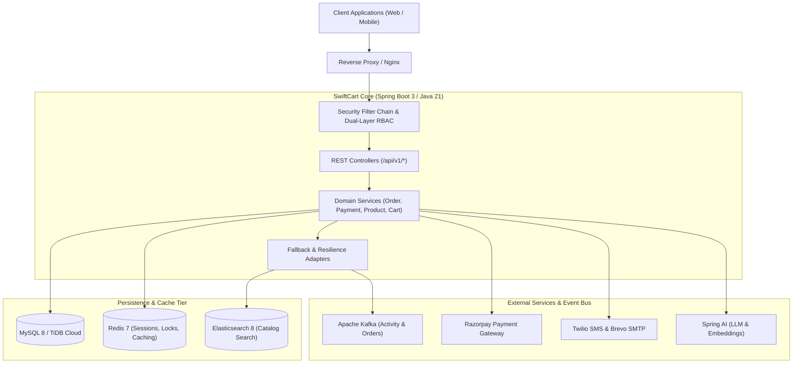

# SwiftCart Backend ⚡

[](https://github.com/shelakeemahesh/SwiftCart-Backend/actions/workflows/ci.yml)
[](https://github.com/shelakeemahesh/SwiftCart-Backend/actions/workflows/codeql.yml)
[](https://opensource.org/licenses/MIT)
[](https://adoptium.net/)
[](https://spring.io/projects/spring-boot)
[](https://github.com/users/shelakeemahesh/projects/9)

SwiftCart is an enterprise-grade e-commerce platform engineered for high-concurrency retail operations. This repository houses the robust, production-ready Spring Boot backend engine powering catalog discovery, transactional order workflows, Razorpay payment processing, Kafka-driven live activity streams, and AI-powered conversational assistance.

---

## 🏗️ System Architecture



---

## 🛠️ Technology Stack

| Layer | Technology | Purpose |
| ----- | ---------- | ------- |
| **Language & Runtime** | Java 21 (Temurin LTS) | Modern high-performance runtime |
| **Framework** | Spring Boot 3.3.10 | Core microservice framework |
| **Security** | Spring Security 6 & JJWT | Stateless JWT + Dual-layer RBAC |
| **Persistence** | Spring Data JPA & Hibernate 6 | Relational data mapping & pessimistic locking |
| **Database** | MySQL 8 / TiDB Cloud | Primary transactional ACID data store |
| **Cache & Idempotency**| Redis (Spring Data Redis) | Rate limiting, lock guards, and session caches |
| **Search Engine** | Elasticsearch 8 | Full-text catalog search with DB fallback |
| **Event Streaming** | Apache Kafka | Asynchronous event publishing and live feeds |
| **Payments** | Razorpay SDK | Payment orders, webhook verification, refunds |
| **AI & Assistants** | Spring AI & LingPipe | Conversational support and review sentiment analysis |
| **Testing** | JUnit 5, Mockito, AssertJ, H2 | Unit, integration, and security test matrix |

---

## 🌟 Core Features

- **Dual-Layer RBAC**: Coarse-grained URL pattern filters combined with fine-grained `@PreAuthorize` owner expressions preventing IDOR and privilege escalation.
- **Pessimistic Locking**: Prevents double checkout and inventory overselling during flash sales and high concurrency.
- **Payment Idempotency**: Redis-guarded webhook processing with HMAC-SHA256 signature verification.
- **Resilient Fallback Search**: Automatic in-memory database query fallback if Elasticsearch cluster is offline or disabled.
- **Live User Activity Stream**: Real-time Kafka topic streaming for purchases and cart activities.
- **AI Chatbot & Order Inquiries**: Automated customer support with catalog RAG and integrated refund processing.

---

## 📋 Environment Variables

Configure these keys in a `.env` file in the root directory (see `.env.example` for defaults):

| Variable | Description | Default (Local) |
| -------- | ----------- | --------------- |
| `PORT` | HTTP server listening port | `8080` |
| `SPRING_PROFILES_ACTIVE` | Active profile (`dev`, `test`, `prod`) | `dev` |
| `SPRING_DATASOURCE_URL` | MySQL JDBC connection string | `jdbc:mysql://localhost:3306/swiftcart?useSSL=false` |
| `SPRING_DATASOURCE_USERNAME` | Database username | `root` |
| `SPRING_DATASOURCE_PASSWORD` | Database password | `secret` |
| `REDIS_HOST` | Redis cache hostname | `localhost` |
| `REDIS_PORT` | Redis cache port | `6379` |
| `REDIS_PASSWORD` | Redis authentication password | *empty* |
| `SPRING_KAFKA_ENABLED` | Toggle Kafka producer/consumers | `false` |
| `KAFKA_BROKERS` | Kafka bootstrap server list | `localhost:9092` |
| `ELASTICSEARCH_ENABLED` | Toggle Elasticsearch catalog queries | `false` |
| `ES_HOST` | Elasticsearch host | `localhost` |
| `ES_PORT` | Elasticsearch HTTP port | `9200` |
| `JWT_SECRET` | 512-bit Base64 secret key for JWT signing | *set-in-env* |
| `RAZORPAY_KEY_ID` | Razorpay Merchant Key ID | *set-in-env* |
| `RAZORPAY_KEY_SECRET` | Razorpay Merchant Secret Key | *set-in-env* |
| `RAZORPAY_WEBHOOK_SECRET`| Razorpay Webhook Signing Secret | *set-in-env* |

---

## 🚀 Quick Start (Local Development)

### 1. Prerequisites
- Docker & Docker Compose
- JDK 21
- Maven 3.9+

### 2. Launch Supporting Infrastructure
```bash
docker compose up -d
```

### 3. Run the Backend Application
```bash
mvn spring-boot:run
```
The API is available at `http://localhost:8080`.
- Health Check: `http://localhost:8080/actuator/health`
- Swagger UI: `http://localhost:8080/swagger-ui.html`

---

## 🧪 Testing

```bash
# Run unit and fallback test suite
mvn clean test

# Run specific integration test
mvn test -Dtest=RbacMatrixIntegrationTest
```

---

## 📁 Repository Structure

```
├── .github/              # CI/CD workflows, issue & PR templates, CODEOWNERS
├── docs/                 # Architecture, ADRs, API docs, runbooks, onboarding
│   ├── adr/              # Architecture Decision Records
│   ├── architecture.md   # Detailed architecture and sequence diagrams
│   ├── api.md            # REST API reference
│   ├── deployment.md     # Production deployment topology
│   ├── onboarding.md     # Developer onboarding steps
│   ├── rbac-reference.md # RBAC permission matrix
│   └── runbook.md        # Operational incident triage guide
├── scripts/              # Developer scripts and smoke tests
├── src/
│   ├── main/java/com/swiftcart/
│   │   ├── config/       # Spring configuration beans
│   │   ├── controller/   # REST API controllers
│   │   ├── dto/          # Request/response DTOs
│   │   ├── entity/       # JPA entities
│   │   ├── enums/        # Domain enumerations
│   │   ├── exception/    # Centralized @ControllerAdvice handlers
│   │   ├── kafka/        # Kafka consumers and producers
│   │   ├── repository/   # Spring Data JPA repositories
│   │   ├── security/     # Security filters, OAuth2, RBAC expression
│   │   ├── service/      # Business logic and resilience adapters
│   │   └── util/         # Utility classes
│   └── test/java/        # Comprehensive test suites
├── Dockerfile            # Container build specification
└── docker-compose.yml    # Local multi-container infrastructure
```

---

## 📚 Documentation & Governance

- [Architecture Specification](docs/architecture.md)
- [Architecture Decision Records (ADRs)](docs/adr/0001-record-architecture-decisions.md)
- [REST API Reference](docs/api.md)
- [Operational Runbook](docs/runbook.md)
- [Developer Onboarding](docs/onboarding.md)
- [Contributing Guidelines](CONTRIBUTING.md)
- [Security Policy](SECURITY.md)
- [Changelog](CHANGELOG.md)
- [GitHub Project Board](https://github.com/users/shelakeemahesh/projects/9)

---

## 📄 License

This project is licensed under the [MIT License](LICENSE).
