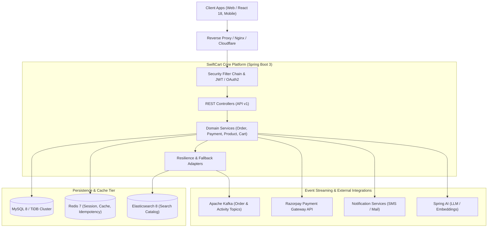
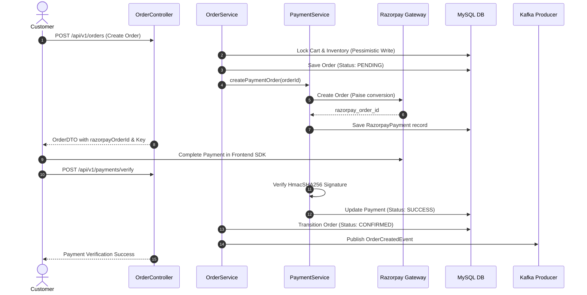
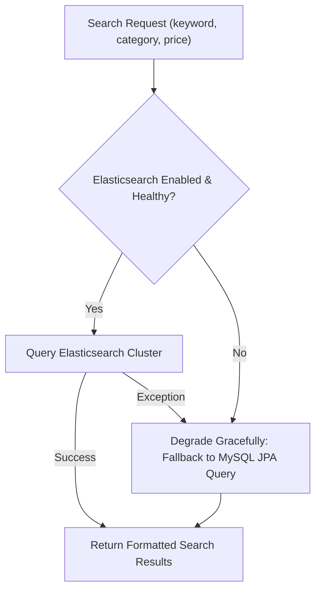

# SwiftCart Backend — Architecture Specification

This document details the software architecture, modular boundaries, security enforcement layers, data pipelines, and resilience fallbacks for the SwiftCart Backend platform.

---

## 1. System Overview & Context

SwiftCart Backend is an enterprise-grade e-commerce application platform powered by **Spring Boot 3 (Java 21)** and **Spring Security 6**. It manages product catalogs, shopping carts, transactional order state machines, Razorpay payment integrations, AI-powered conversational assistance, and Kafka-driven real-time live activity tracking.

---

## 2. Layered Architecture

SwiftCart strictly enforces a package-by-feature layered architecture with clear boundaries:

1. **Controller Layer (`com.swiftcart.controller`)**:
   - HTTP request parsing, status codes, OpenAPI documentation.
   - Bean validation (`@Valid`) on all request DTOs.
   - Delegates business execution immediately to domain services.

2. **Security & Authorization Layer (`com.swiftcart.security`)**:
   - **Coarse-Grained Gateway Filtering**: Enforced via `SecurityConfig` route matchers (`/api/v1/admin/**`, `/api/v1/seller/**`, `/api/v1/user/**`).
   - **Fine-Grained Method Expressions**: Enforced via `@PreAuthorize("@swiftCartSecurity.isOwnerOrAdmin(#userId, authentication)")` using custom evaluator `SwiftCartSecurityExpression`.
   - **OAuth2 Bridge**: Custom authorization request repository (`HttpCookieOAuth2AuthorizationRequestRepository`) with user info extraction factory.

3. **Domain Service Layer (`com.swiftcart.service`)**:
   - Business state transitions, transactional workflows (`@Transactional`), and concurrency defense.
   - Graceful resilience fallbacks when backing systems (Redis, Kafka, Elasticsearch) fail.

4. **Persistence Layer (`com.swiftcart.repository`)**:
   - Spring Data JPA with Hibernate 6.
   - Pessimistic write locks (`@Lock(LockModeType.PESSIMISTIC_WRITE)`) on inventory stock updates and order status transitions to prevent double-checkout and race conditions.

---

## 3. Data Flow & Transactional Workflows

### 3.1 Checkout & Payment State Machine

### 3.2 Search & Discovery Resilience Pattern

---

## 4. Resilience & Fault Tolerance Guarantees

1. **Database Fallback for Search**: When Elasticsearch is unavailable or disabled, search queries dynamically degrade to database wildcard/index queries without failing customer traffic.
2. **Redis Caching Degradation**: Key-value operations wrap in fallback guards (`RedisFallbackService`); if Redis drops, the application falls back directly to database queries.
3. **Kafka Disconnect Tolerance**: Kafka producers log events asynchronously with retry policies; failure to publish events does not abort transactional order commits.
4. **Idempotent Webhooks**: Redis locks guard webhook callbacks (`razorpay_signature`) preventing duplicate delivery charges or double fulfillment.
